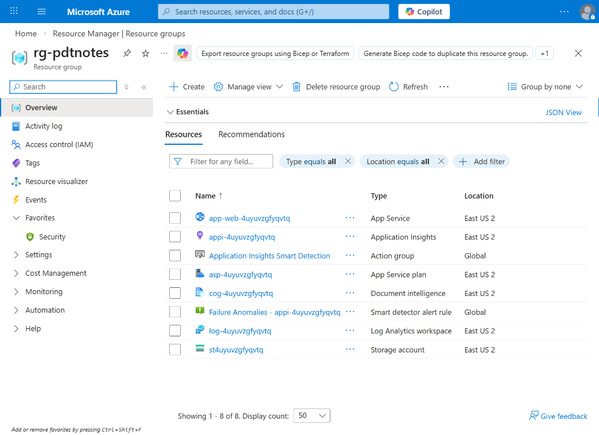
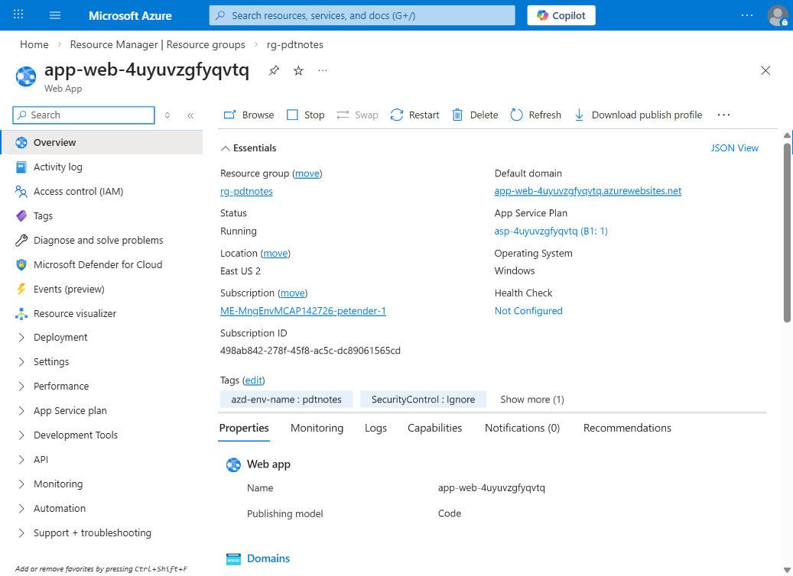
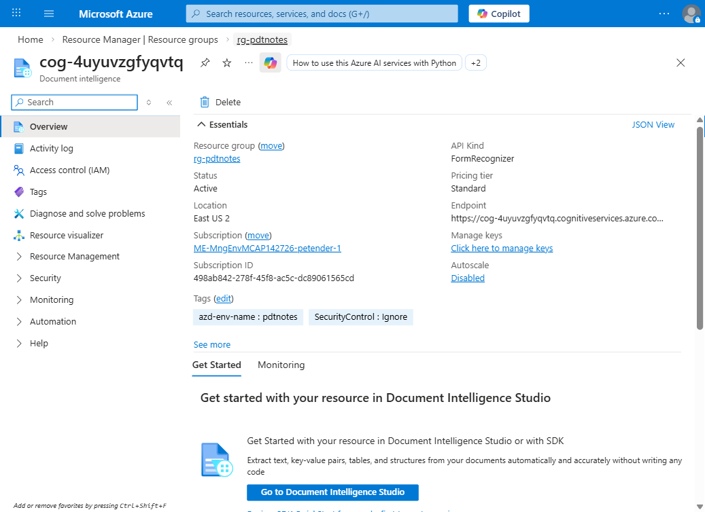
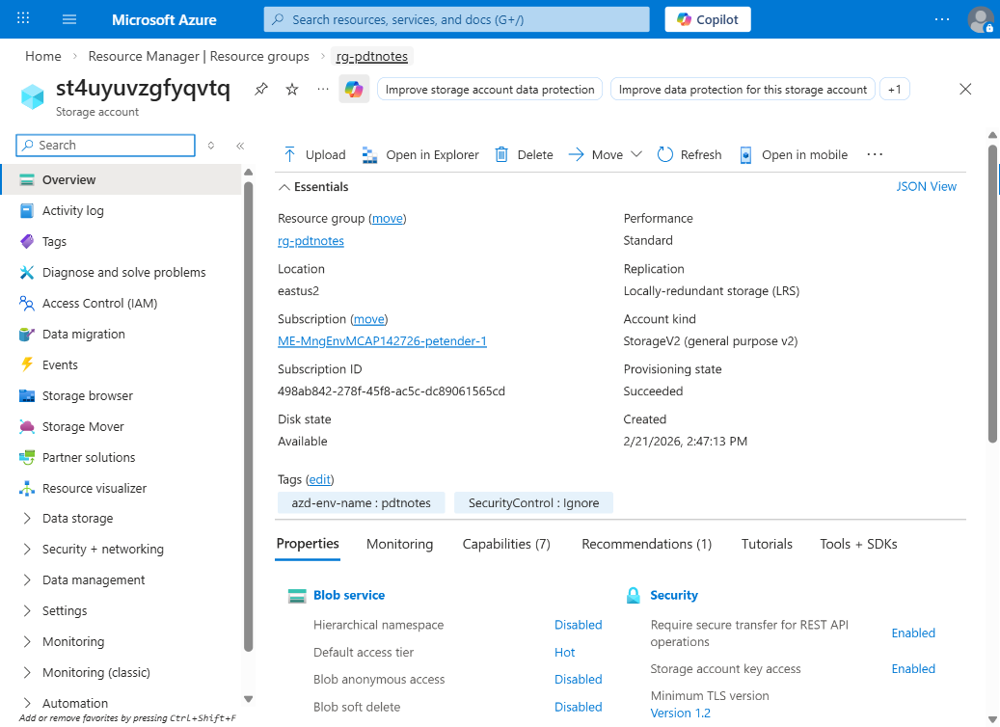
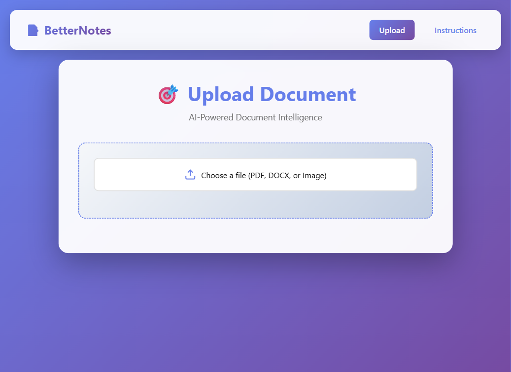
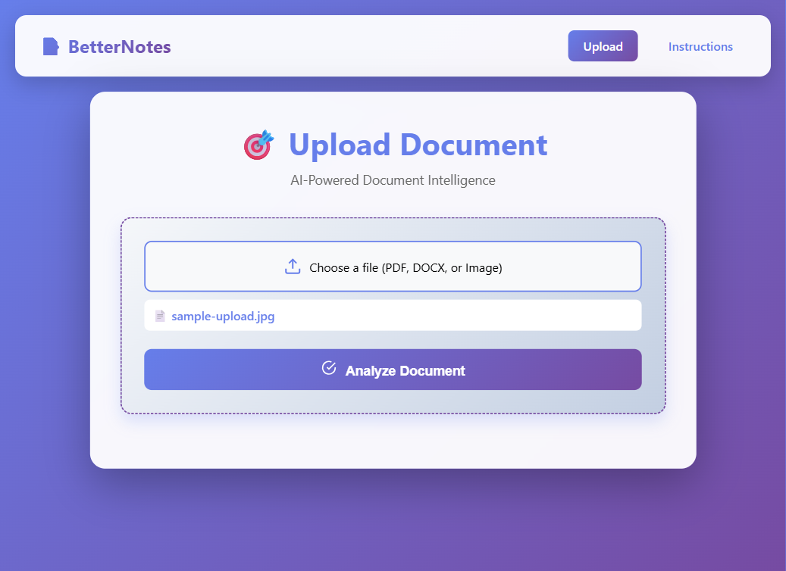
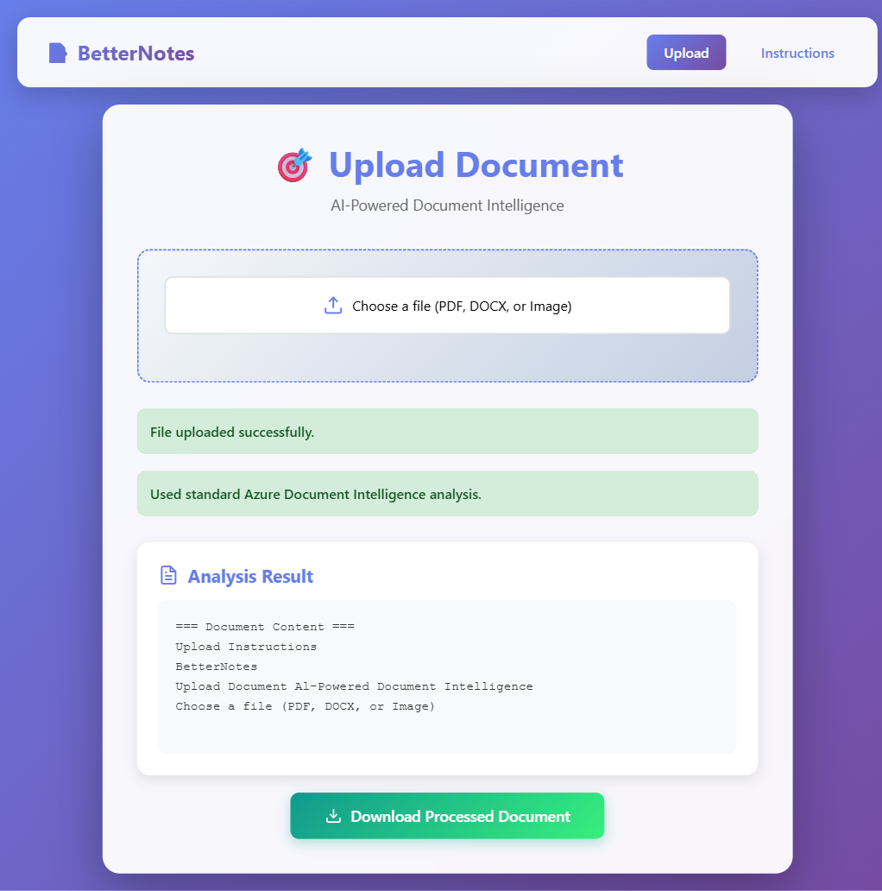
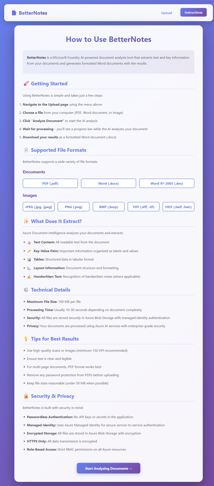

[comment]: <> (please keep all comment items at the top of the markdown file)
[comment]: <> (please do not change the ***, as well as 
 placeholders for Note and Tip layout)
[comment]: <> (please keep the ### 1. and 2. titles as is for consistency across all demoguides)
[comment]: <> (section 1 provides a bullet list of resources + clarifying screenshots of the key resources details)
[comment]: <> (section 2 provides summarized step-by-step instructions on what to demo)

[comment]: <> (this is the section for the Note: item; please do not make any changes here)
***
### Azure Document Intelligence with BetterNotes ASP.NET Core app - demo scenario

**Note:** Below demo steps should be used **as a guideline** for doing your own demos. Please consider contributing to add additional demo steps.

[comment]: <> (this is the section for the Tip: item; consider adding a Tip, or remove the section between 
 and 
 if there is no tip)

**Tip:** For handwritten notes, demo both formats: (1) a PDF export (best OCR reliability), and (2) DOCX to show the app's automatic handwritten detection path and fallback behavior.

***
### 1. What Resources are getting deployed
This scenario deploys **a production-ready ASP.NET Core Web App** that allows users to upload PDF, DOCX, and image files, run AI-based document analysis, and download a generated Word document with extracted results.

This scenario is based on these Azure resources:
* `rg-pdtnotes` - Azure Resource Group for the full solution.
* `app-web-4uyuvzgfyqvtq` - Azure App Service hosting the BetterNotes web app.
* `asp-4uyuvzgfyqvtq` - Azure App Service Plan for compute hosting.
* `cog-4uyuvzgfyqvtq` - Azure Document Intelligence (Form Recognizer) resource for OCR and analysis.
* `st4uyuvzgfyqvtq` - Azure Storage Account for uploaded and processed files.
* `appi-4uyuvzgfyqvtq` + `log-4uyuvzgfyqvtq` - Application Insights and Log Analytics for monitoring.

  

Key resource blades to show in Azure Portal:

  

  

  

### 2. What can I demo from this scenario after deployment

This demo works best if you **first show the app experience**, then briefly map each capability to Azure resources.

#### 2a. Using the BetterNotes web app

1. Once deployment is complete, open the web app URL from App Service (Default domain).
1. Confirm the Upload landing page loads.

  

1. Select a file (PDF, DOCX, or image).
1. Click **Analyze Document**.
1. Explain that the app uploads the file, runs Document Intelligence analysis, and generates a downloadable `.docx` result.

  

1. Show the final output section:
    - upload success status,
    - analysis mode message,
    - extracted content preview,
    - **Download Processed Document** button.

  

1. (Optional) Open the **Instructions** page to walk through supported formats, limits, and best practices.

  

#### 2b. Azure Portal walkthrough

1. From the Azure Portal, navigate to the Resource Group for this scenario.
1. Show the Resource Group overview and highlight deployed components.

  

1. Open **App Service** and show:
    - running state,
    - default domain,
    - hosting plan.

  

1. Open **Document Intelligence** and show:
    - endpoint,
    - API kind,
    - pricing tier,
    - where keys/endpoint are managed.

  

1. Open **Storage Account** and show:
    - account tier and replication,
    - that uploads/processed documents are stored securely,
    - relationship to app upload/download flow.

  

#### Application Code view [Optional demo, for developer audience]

Assuming deployment through AZD, you can also show code-to-cloud traceability:

1. `Services/AzureAIService.cs` - file analysis + DOCX handwritten handling path.
1. `Services/BlobStorageService.cs` - Azure/local storage abstraction.
1. `Pages/Upload.cshtml(.cs)` - upload UX and processing workflow.
1. `infra/` Bicep modules - App Service, Document Intelligence, Storage, and monitoring resources.

[comment]: <> (this is the closing section of the demo steps. Please do not change anything here to keep the layout consistant with the other demoguides.)
  
***

**Note:** This is the end of the current demo guide instructions.

